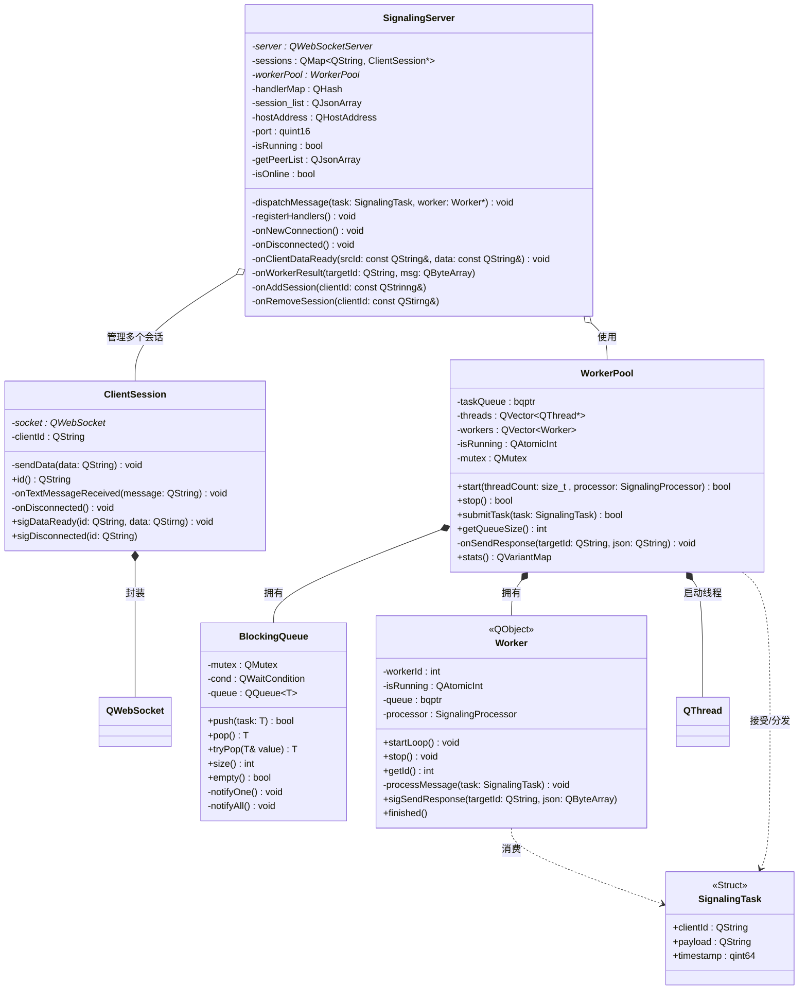

# 极简信令服务器
## 功能
本项目面向的场景为局域网内屏幕共享，因此信令服务器的实现不考虑复杂的房间管理等问题，只实现了基本功能：
- 连接管理：基于QWebSocket封装ClientSession类，并由信令服务器为客户端分享独立的ID
- 信令消息转发：信令服务器实现了基本的路由功能，线程池的加入，可以满足一定的高并发请求

## UML类图


## SignalingServer API
SignalingServer类采用单例模式进行实现，对外只暴露三个接口。分别是**获取实例、启动服务器、关闭服务器**。

### `getInstance`
函数原型：
```C++
static SignalingServer* getInstance(const QHostAddress& address = QHostAddress::Any, quint16 port = 11290, int workerNum = DEFAULT_WORKER_NUMBER);
```
SignalingServer使用单例模式实现，确保全局只存在一个实例，需要通过该接口获得实例。内部依赖C++11标准的静态变量的资源申请机制，是线程安全且懒加载的。

参数：
- `address`: 传入Qt框架下封装的IP地址，详见 [QHostAddress Class | Qt Network](https://doc.qt.io/qt-6/qhostaddress.html) 。缺省参数`QHostAddress::Any`将会监听 IPv4 和 IPv6 的所有地址。地址可以在调用`start`接口的时候再次指定。
- `port`：传入一个端口号，指定本地的监听端口。端口可以在调用`start`接口的时候再次指定。
- `workerNum`：指定信令服务器的业务线程的线程数量，默认数量为**2**。

### `start`
函数原型：
```C++
bool start(const QHostAddress& address = QHostAddress::Any, quint16 port = 11290);
```
可以在启动信令服务器的时候指定坚定的对端IP地址以及端口。

参数：
- `address`: 传入Qt框架下封装的IP地址，详见 [QHostAddress Class | Qt Network](https://doc.qt.io/qt-6/qhostaddress.html) 。缺省参数`QHostAddress::Any`将会监听 IPv4 和 IPv6 的所有地址。
- `port`:传入一个端口号，指定本地的监听端口。

### `stop`
函数原型:
```C++
bool stop();
```
手动停止服务器。调用后，信令服务器将不会再处理任何的连接请求。

## 信令消息格式
见**signaling-server/doc/SignalingMessage.md**

## Quick Start
### 项目环境
- Compiler: MSVC v143 (Visual Studio 2022, x64)
- CMake: 3.24+
- Qt: 6.8.3 (msvc2022_64)
- C++ Standard: C++17
### 项目构建
使用CMake进行项目自动化构建，便能直接得到信令服务器的可执行文件，默认的监听端口为*11290*

或者在**signaling-server/src**目录下，运行以下命令：
```shell
cmake -B build -S . -DCMAKE_PREFIX_PATH="to your qt dir" -T host=x64 -A x64
```